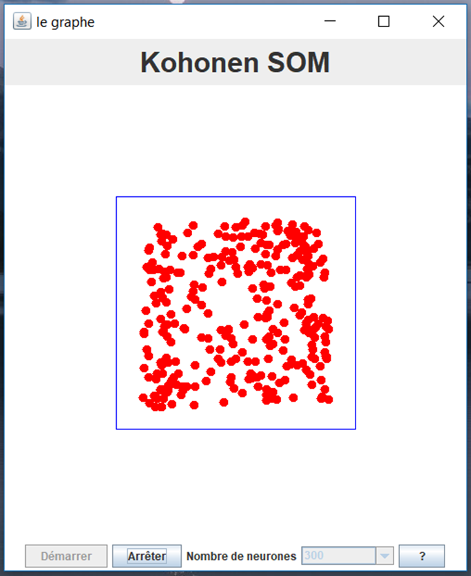
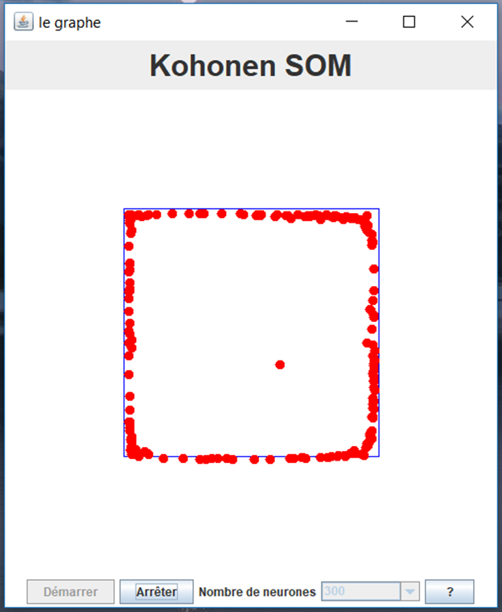
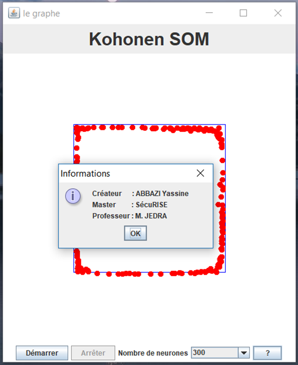

# Kohonen's SOM
## Master's Degree projects (July 2012)

This is a program written in Java with a Human Machine Interface (HMI)

**Kohonen's SOM** is a Contour detector using Neural Networks (Kohonen’s SOM)

### How to use it:
To run the program execute _**"kohonenJar.jar"**_ by double-clicking it, 

This is an example of a rectangle:

Start:

End:

